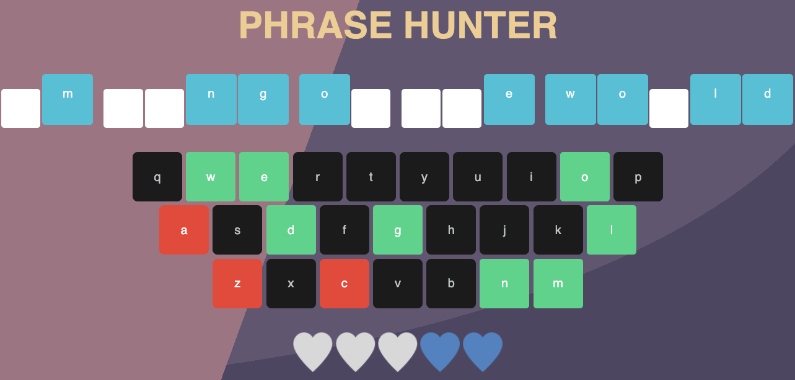
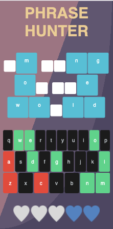

# OOP Phrase Guessing Browser Game

A browser-based, word guessing game: "Phrase Hunter." using JavaScript and OOP (Object-Oriented Programming) to select a random,
hidden phrase, which a player tries to guess, by clicking letters on an onscreen keyboard.

The Game has three different screens: "Start" screen, "Game" screen, and "Game over" screen.

- "Start" screen:- This screen contains the START button, by clicking the button the game begins. Custom CSS style has been
  added using linear-gradient for the background, START button, and the title.

- "Game" screen:- This screen is revealed only after clicking the START button. A random phrase is added to the display, and
  the letters of the phrase are hidden. An onscreen keyboard is present, which can be used to 'guess', i.e reveal the letters
  of the phrase. Custom CSS has been used to make the keyboard look like keys of a macbook, and changes have been made to the
  background, and 'live heart'.

- "Game over" screen:- this screen is revealed at the end of the game. If the player has 'guess', i.e. revealed all the
  letters of the onscreen phrase, a custom message notifying the game has been won is displayed. if the player has 'guessed'
  5 wrong guesses, a custom message notifying the game has been lost is displayed. The win and lose screens have different colours.

Explanation of the working of Classes and Functionality:

There are two Classes that make up the game:- Game, and Phrase.

1. Game Class - Game class is present in Game.js file. Details of the class is as follows:-

The constructor for the Game class receives three parameters -

• missed - traces the wrong guesses by the player, initial value is 0.
• phrases - holds an array with objects with 'phrase' key and actual phrases as values.
• activePhrase - holds the active phrase for the current game. initial value is null.

There are eight methods in the Game class, details are as follows -

• createPhrases() - returns an array containing objects with 'phrase' key and actual phrases as values. Assigned to phrases parameter in the constructor.

• getRandomPhrase() - returns a random object from the array stored in the phrases parameter.

• startGame() - starts new instance of the "Game" screen of the app.

• checkForWin() - Checks for winning move. Returns true, if game has been won, i.e all the letter of the activePhrase have been revealed; returns false,
if 5 incorrect guesses have been made.

• removeLife() - Increases the value of the missed property, removes a life from the scoreboard, and checks if player has remaining lives
and ends game if player is out.

• gameOver(gameWon) - Displays game over message on the "Game over" screen, based on whether the game has been won or lost.

• handleInteraction(event, button, letter) - Handles the onscreen keyboard and computer's keyboard interaction. It adds the 'wrong' or 'chosen' class
and disables on the clicked or keydown letter. It reveals letter in the activePhrase on the "Game" screen.

• reset() - Resets the "Game" screen, after a game has been played one time, and the "Game over" screen has been revealed.

2. Phrase Class - Phrase class is present in Phrase.js file. Details of the class is as follows:-

The constructor for the Phrase class receives one parameters -

• phrase - Converts the value assigned to it to lowercase.

There are three methods in the Phrase class, details are as follows -

• addPhraseToDisplay() - Display's phrase on "Game" screen, and hides the character using the 'hide' class.
It also adds the class of 'letter', if the character is letter; or 'space', if character is space (' ').

• checkLetter(letter) - Checks if passed letter is in phrase. Returns true, if present; and false, if not present.

• showMatchedLetter(letter) - Displays passed letter on screen after a match is found.

3. app - app is present in app.js file. Details of the working of the app is as follows:-

The app.js file initializes a new game instance on clicking the 'START GAME' button. It also assigns 'click', and 'keydown' event listeners
on both the onscreen keyboard and player's computer keyboard respectively - both the event listener activate the handleInteraction method of the Game class.
